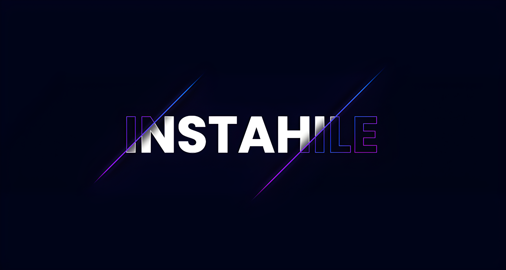

# FREE INSTAGRAM LIKES - WITH TERMUX
<div align="center">
  
  <br>
  <br>
  <p>
    
    
    
    
    
    
  </p>
  <h4> Get Likes On Instagram Using Termux Only ! </h4>
</div>

##

### What is Instahile?
[**Instahile**](https://github.com/RozhakXD/Instahile) is a script to get likes every hour based on a like provider from Turkey. You can also use several sessions in the Termux application to run this script.

### Termux command?
You can also see how to use this script on my [**Youtube**](https://youtu.be/58Jt2lYap14).

Download the [Termux](https://f-droid.org/repo/com.termux_118.apk) application then enter all commands in the Termux application.
```
$ apt update -y && apt upgrade -y
$ pkg install git python-pip
$ git clone https://github.com/RozhakXD/Instahile
$ cd "Instahile"
$ python -m pip install -r requirements.txt
$ python Run.py
```

```
$ cd "$HOME/Instahile" && git pul
$ python Run.py
```

### Why failed to send likes?

- Maybe you entered the wrong post link or Instagram account in a locked state.
- Maybe you don't have credit.
- Maybe the website has an error or is down.

### Requirements for login?

- An Instagram account has a profile photo and one post.
- Use new account or fake account to login.
- After using the script, change the Instagram account password.

### Why does login fail?

- Make sure the Instagram account is logged in and click "IT WAS ME" if it says locked then try again.
- Please check the username and password are they correct?
- You can manually log in on the website **"https://instahile.co/"** then re-login in Termux.
- You must use airplane mode before logging in.
- Please change your Instagram account if the problem occurs repeatedly.
- Change your Instagram password if you still experience login failures.

### Lost Instagram fake account?

- Instagram can block your password so you need to reset the password.
- Change the password after accessing this script to avoid related accounts on the website.
- We recommend that you do not use the original Instagram account.

### No likes arrived?

- Please wait 10 to 30 minutes for all likes to arrive.
- There is a problem when sending likes, it is possible that the post link is problematic.
- There is a problem with the like provider website.

### What is recommended?

- You are required to change the fake account password to avoid losing the account.
- You can use several Termux sessions to get lots of likes.
- You have to use a fake account to login in this script.

### Your Instagram fake account is deactivated or checkpoint?

- Maybe because Instagram has detected that your account is a fake or spam account.
- You can use a phone number to sign up for an Instagram account.
- The Instagram account must have a phone number, email and profile photo.
- Use a new account when logging in and agree if hit by a checkpoint.

### Why are the likes decreasing?

- [Why am I seeing a change in the number of likes, follows or comments on Instagram?](https://help.instagram.com/572730176521116/?helpref=search&query=Mengapa%20saya%20melihat%20ada%20perubahan%20jumlah%20suka%2C%20ikuti%2C%20atau%20komentar%20di%20Instagram%3F&search_session_id=&sr=1).
- Likes are detected as spam by Instagram.
- The accounts of those who like your posts are blocked or deactivated.

### What if there is no credit?

- Rerun the script every hour or let it run in the background.
- You can use another account to get likes.
- You can wait for about an hour for the credit to return.

### Post link requirements?

- Change the reels post to p, for example: **https://www.instagram.com/reels/CXyPwLSJCtl/ -> https://www.instagram.com/p/CXyPwLSJCtl/.**
- Instagram account is not locked or private.
- Get post links in a browser or Instagram Lite application.
- Visit the post link in the browser and make sure the post link is correct.

### Resolve media id not available?

- You took the wrong posting link.
- I believe your Instagram account has been hit by Checkpoint.
- The post link you entered is not available.

### How long does it take for likes to arrive?
Once you convert credits to likes it should arrive on Instagram posts in less than 10 minutes. If more than 10 minutes means there is a problem when exchanging credits to likes.

##
```python
print("Good luck hope it works!")
```
##
